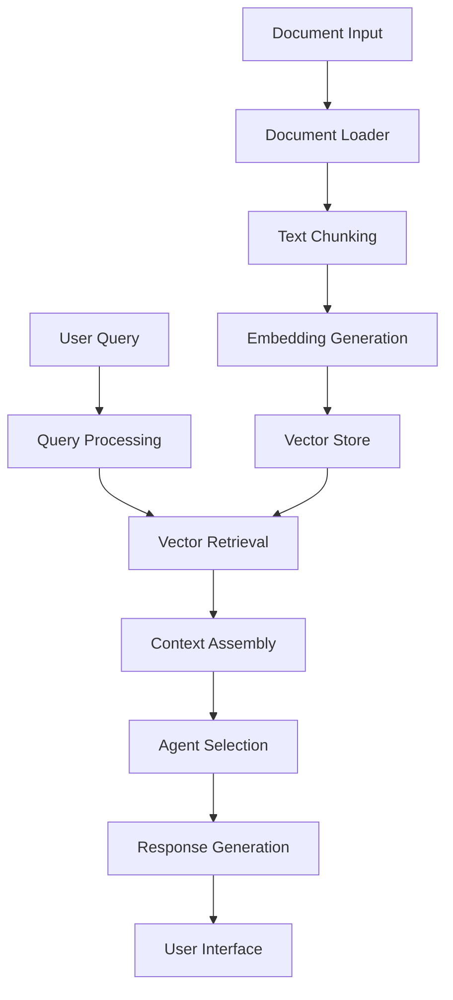

<div align="center">

# ✨ DocuBot ✨

*Multi-Source AI Document Chatbot*

[](https://python.langchain.com/)
[](https://cohere.com/)
[](https://deepmind.google/)
[](https://streamlit.io/)


</div>

## 🌟 Overview

**DocuBot** is an AI-powered multi-agent RAG (Retrieval-Augmented Generation) chatbot that transforms how you interact with documents. Upload various file types or URLs, then ask questions to receive intelligent, context-aware responses through specialized AI agents.

## 🚀 Key Features

### 📊 Multi-Source Document Processing
- **Document Files:** PDF, DOCX with advanced text extraction
- **Image Processing:** JPG, PNG with OCR capabilities
- **Media Content:** YouTube videos (captions or descriptions)
- **Web Content:** Webpage text extraction with custom User-Agent

### 🤖 Intelligent Multi-Agent System
- **Direct Answer Agent:** Precise responses to specific queries
- **Summarize & Critique Agent:** Condensed insights with critical analysis
- **ELI5 Agent:** Simplified explanations for complex topics

### 🔍 Advanced RAG Implementation
- Semantic chunking with optimal overlap
- High-quality embeddings for accurate retrieval
- Context-aware response generation

## ✨ Technology Stack

- **Streamlit** — Beautiful interactive UI
- **LangChain** — RAG pipeline framework
- **Cohere** — Fast embeddings
- **Gemini** — Google's next-gen LLM
- **FAISS** — Vector similarity search
- **PyMuPDF, python-docx, pytesseract, PIL** — Local parsing & OCR
- **pytube, yt-dlp** — Robust YouTube caption fallback

## 🛠️ Architecture



## 💻 Installation

```bash
# Clone the repository
git clone https://github.com/yourusername/docubot.git
cd docubot

# Install dependencies
pip install -r requirements.txt

# Set up environment variables
echo "COHERE_API_KEY=your_cohere_api_key" > .env
echo "GOOGLE_API_KEY=your_google_api_key" >> .env
echo "USER_AGENT=docubot" >> .env

# Run the application
streamlit run app.py
```

## 🔮 Usage

1. **Upload Documents:** Use the file uploader to add PDFs, DOCXs, or images
2. **Or Enter URL:** Paste a YouTube video or webpage URL
3. **Select Agent Mode:** Choose between Direct Answer, Summarize + Critique, or ELI5
4. **Ask Questions:** Type your query and receive AI-generated responses

## 🌈 Future Enhancements

- **Multi-Modal Support:** Process and reason about images within documents
- **Memory System:** Maintain conversation context for follow-up questions
- **Custom Agents:** Allow users to define specialized agents for domain-specific tasks
- **Collaborative Features:** Share documents and insights with team members
- **Export Functionality:** Save conversations and insights in various formats

## 📜 License

MIT License

---

<div align="center">
  <p>Created with ❤️ by <a href="https://github.com/yourusername">Your Name</a></p>
  <p>✨ Happy Document Chatting! ✨</p>
</div>


