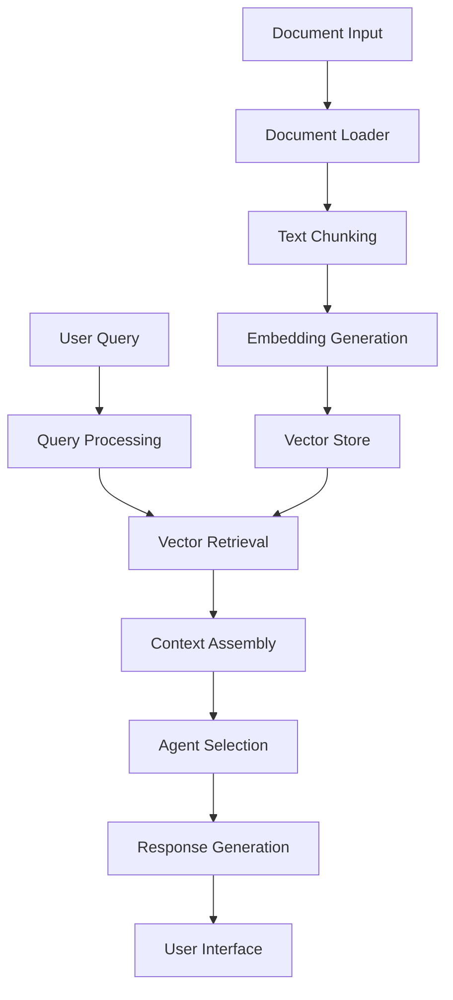

<div align="center">

<h1 style="font-size: 3em; background: linear-gradient(to right, #7F7FD5, #86A8E7, #91EAE4); -webkit-background-clip: text; -webkit-text-fill-color: transparent; animation: glow 2s ease-in-out infinite alternate;">
  ✨ DocuBot ✨
</h1>

<p style="font-size: 1.5em; color: #6c63ff; margin-bottom: 30px; animation: fadeIn 2s ease-in-out;">Multi-Source AI Document Chatbot</p>


<p align="center">
  
</p>

</div>

<style>
@keyframes glow {
  from {
    text-shadow: 0 0 10px #7F7FD5, 0 0 20px #7F7FD5, 0 0 30px #7F7FD5;
  }
  to {
    text-shadow: 0 0 20px #91EAE4, 0 0 30px #91EAE4, 0 0 40px #91EAE4;
  }
}

@keyframes fadeIn {
  from { opacity: 0; }
  to { opacity: 1; }
}

@keyframes float {
  0% { transform: translateY(0px); }
  50% { transform: translateY(-20px); }
  100% { transform: translateY(0px); }
}

@keyframes pulse {
  0% { transform: scale(1); }
  50% { transform: scale(1.05); }
  100% { transform: scale(1); }
}

.feature-card {
  background: rgba(255, 255, 255, 0.1);
  backdrop-filter: blur(10px);
  border-radius: 10px;
  padding: 20px;
  margin: 10px 0;
  border: 1px solid rgba(255, 255, 255, 0.2);
  transition: all 0.3s ease;
  animation: pulse 4s infinite;
}

.feature-card:hover {
  transform: translateY(-5px);
  box-shadow: 0 10px 20px rgba(0, 0, 0, 0.1);
}

.tech-pill {
  display: inline-block;
  padding: 5px 15px;
  margin: 5px;
  border-radius: 20px;
  background: linear-gradient(45deg, #6c63ff, #4834d4);
  color: white;
  font-weight: bold;
  transition: all 0.3s ease;
}

.tech-pill:hover {
  transform: scale(1.05);
  box-shadow: 0 5px 15px rgba(108, 99, 255, 0.5);
}
</style>

## 🌟 Overview

**DocuBot** is an AI-powered multi-agent RAG (Retrieval-Augmented Generation) chatbot that transforms how you interact with documents. Upload various file types or URLs, then ask questions to receive intelligent, context-aware responses through specialized AI agents.

<div class="feature-card">

## 🚀 Key Features

### 📊 Multi-Source Document Processing
- **Document Files:** PDF, DOCX with advanced text extraction
- **Image Processing:** JPG, PNG with OCR capabilities
- **Media Content:** YouTube videos (captions or descriptions)
- **Web Content:** Webpage text extraction with custom User-Agent

### 🤖 Intelligent Multi-Agent System
- **Direct Answer Agent:** Precise responses to specific queries
- **Summarize & Critique Agent:** Condensed insights with critical analysis
- **ELI5 Agent:** Simplified explanations for complex topics

### 🔍 Advanced RAG Implementation
- Semantic chunking with optimal overlap
- High-quality embeddings for accurate retrieval
- Context-aware response generation

</div>

## ✨ Technology Stack

<div style="text-align: center; margin: 30px 0;">
  <span class="tech-pill">Streamlit</span>
  <span class="tech-pill">LangChain</span>
  <span class="tech-pill">Cohere</span>
  <span class="tech-pill">Gemini</span>
  <span class="tech-pill">FAISS</span>
  <span class="tech-pill">PyMuPDF</span>
  <span class="tech-pill">python-docx</span>
  <span class="tech-pill">pytesseract</span>
  <span class="tech-pill">PIL</span>
  <span class="tech-pill">pytube</span>
  <span class="tech-pill">yt-dlp</span>
</div>

## 🛠️ Architecture



## 💻 Installation

```bash
# Clone the repository
git clone https://github.com/yourusername/docubot.git
cd docubot

# Install dependencies
pip install -r requirements.txt

# Set up environment variables
echo "COHERE_API_KEY=your_cohere_api_key" > .env
echo "GOOGLE_API_KEY=your_google_api_key" >> .env
echo "USER_AGENT=docubot" >> .env

# Run the application
streamlit run app.py
```

## 🔮 Usage

1. **Upload Documents:** Use the file uploader to add PDFs, DOCXs, or images
2. **Or Enter URL:** Paste a YouTube video or webpage URL
3. **Select Agent Mode:** Choose between Direct Answer, Summarize + Critique, or ELI5
4. **Ask Questions:** Type your query and receive AI-generated responses

## 🌈 Future Enhancements

- **Multi-Modal Support:** Process and reason about images within documents
- **Memory System:** Maintain conversation context for follow-up questions
- **Custom Agents:** Allow users to define specialized agents for domain-specific tasks
- **Collaborative Features:** Share documents and insights with team members
- **Export Functionality:** Save conversations and insights in various formats

## 📜 License

MIT License

---

<div align="center" style="margin-top: 50px; animation: fadeIn 3s ease-in-out;">
  <p>Created with ❤️ by <a href="https://github.com/yourusername">Your Name</a></p>
  <p style="color: #6c63ff;">✨ Happy Document Chatting! ✨</p>
</div>


